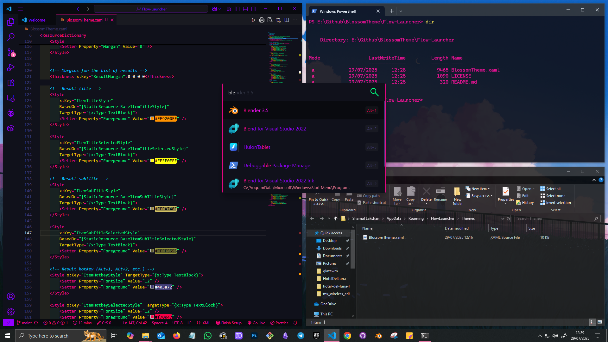
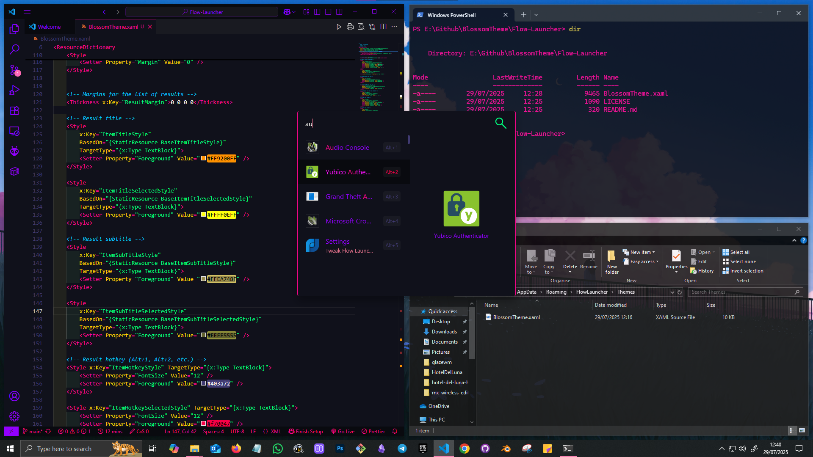
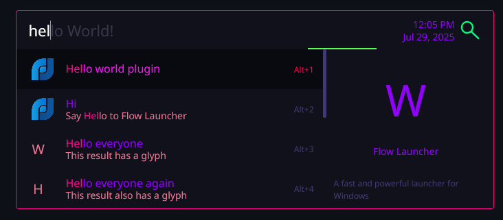

# Blossom Theme for [App/Service/etc... Name]

## Preview <!---Do not chang headers (Required for WebBuilder)-->




## Installation <!---Do not chang headers (Required for WebBuilder. Keep the content text-based to avoid WebBuilder conflicts)-->
1. Download the theme file ```BlossomTheme.xaml```.
2. Open the Flow Launcher Theme folder.
   ```C:\Users\<USERNAME>\AppData\Roaming\FlowLauncher\Themes```
3. Copy the theme file to the theme folder.
4. Restart Flow Launcher.
5. Open Flow Launcher Settings
   Appearences > Theme > BlossomTheme
6. Enjoy!

